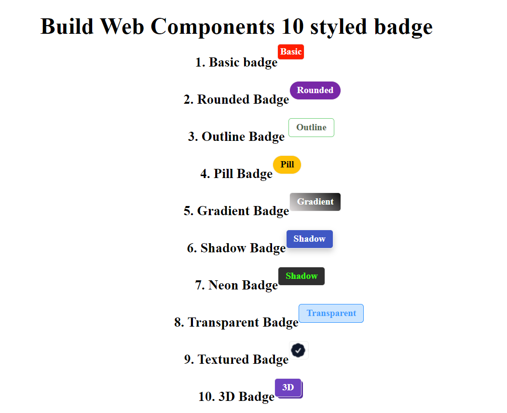

# 10 Styled badge components
This repository contains HTML and CSS code for creating 10 different styled badge components. Each form component is designed with unique styles and layouts to suit various use cases. 

## List of styled form include - 
1. Basic Badge 
1. Rounded Badge 
1. Outline Badge 
1. Pill Badge
1. Gradient Badge
1. Shadow Badge
1. Neon Badge
1. Transparent Badge
1. Textured Badge
1. 3D Badge

## Snap-shot

