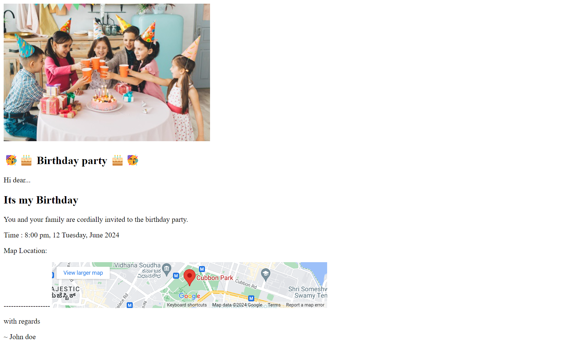

# Event invitation page
This project is a simple HTML webpage that displays Event invitation for a birthday party

## Overview 
The Event invitation Pages project is designed to show a birthday invitation kind of card to friends, family and colleague  from different places using HTML.

[Deployment Link](https://event-invitation-pagepw.netlify.app/)

## Usage 

- You can add your name and birthday details
- send it to your friends, family and colleague as an invitation card for your birthday event.

