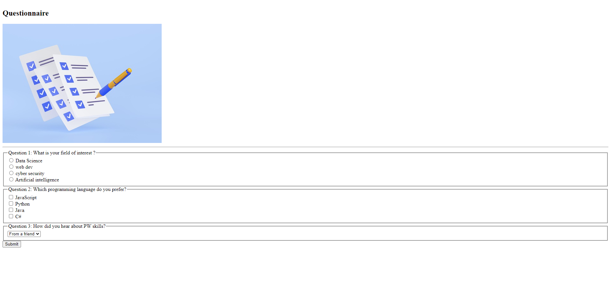

# Questionnaire Project
This project is a simple static HTML form that mimic the collection of responses from users through a questionnaire

## Overview 
The Questionnaire Project is designed to gather information from users using an HTML form. It presents a series of questions and allows users to select answers or provide input based on the questionnaire's prompts.

[Deployment Link](https://questionnarepw.netlify.app/)

## Usage 
You can use this project to:
- Create and distribute custom questionnaires for various purposes.
- Collect responses and data from users efficiently.
- Customize the questions and form elements to suit your specific needs.

