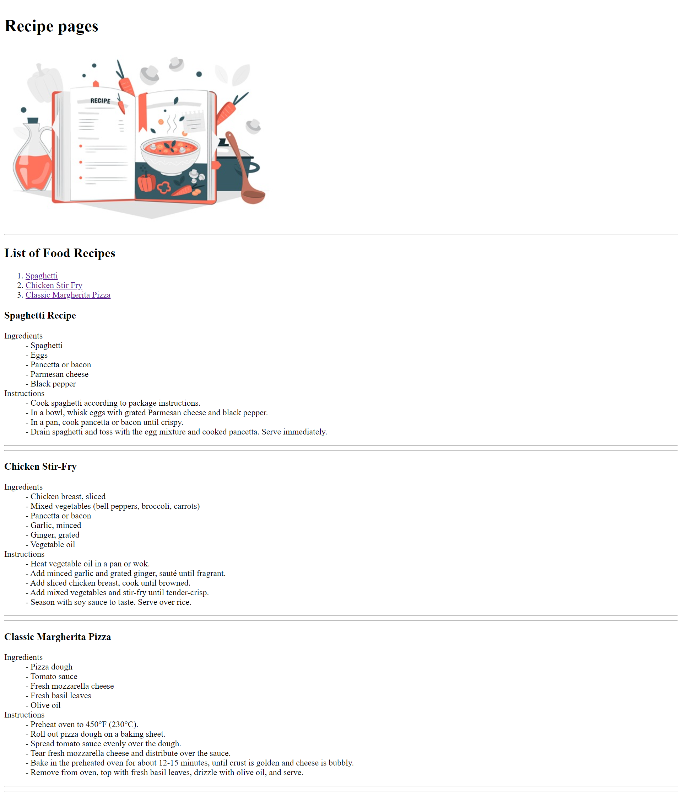

# Recipe Pages Project
This project is a simple HTML webpage that displays various food recipes with ingredients and instructions.

## Overview 
The Recipe Pages project is designed to showcase different food recipes using HTML. Each recipe is displayed on a separate section of the webpage, providing details about the ingredients needed and step-by-step instructions for preparation.

## Usage 
You can use this project to: 
- Browse and view different food recipes.
- Learn how to prepare specific dishes with clear instructions
- Customize and expand the recipe collection by adding more recipes.

