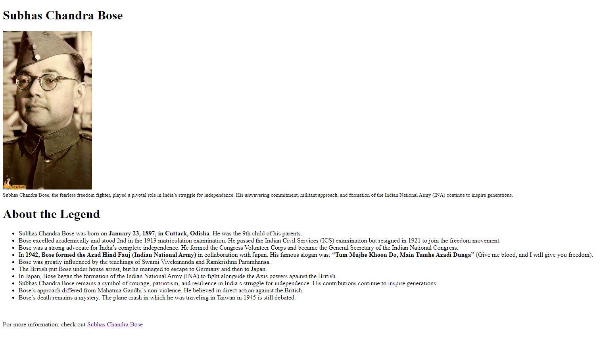

# Tribute Page

This project is a simple tribute page dedicated to Subhas Chandra Bose, a fearless freedom fighter who played a pivotal role in India's struggle for independence.

## Project Overview

The tribute page is a static HTML page that provides information about Subhas Chandra Bose's life, his contributions to India's freedom struggle, and his lasting impact on the nation.

## Features

- A brief biography of Subhas Chandra Bose.
- A list of his significant achievements and contributions.
- An image of Subhas Chandra Bose.
- A link to a more detailed Wikipedia article about him.

## Technologies Used

- HTML5: Used for creating the structure of the webpage.

## How to View

You can view the webpage by opening the `index.html` file in any web browser.

## Output

