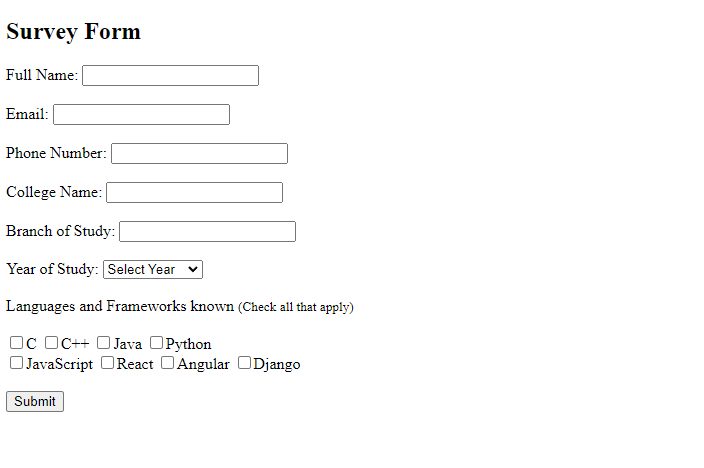

# Survey Form

This project is a simple survey form designed to gather information from students.

## Project Overview

The survey form is a static HTML page that collects the following information from a user:
- Full Name
- Email
- Phone Number
- College Name
- Branch of Study
- Year of Study
- Known Languages and Frameworks

## Technologies Used

- HTML5: Used for creating the structure of the webpage.

## How to View

You can view the webpage by opening the `index.html` file in any web browser.

## Output

