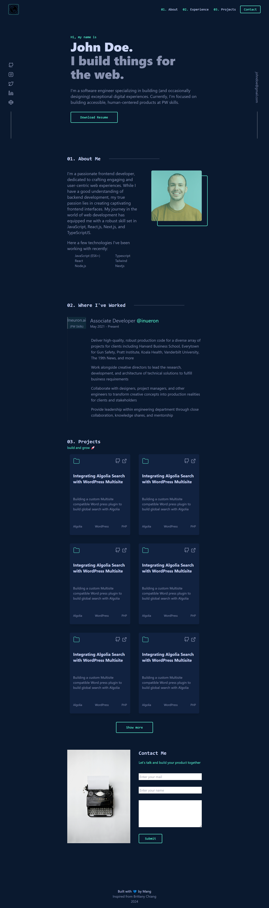

# Portfolio Project with Tailwind CSS

## Description
This is a personal portfolio website created using HTML and Tailwind CSS. The website includes the following sections:
- Hero Section
- About
- Work Experience
- Projects
- Contact Me
- footer

## snapshot 

## Sections

### Hero Section
The hero section is the first section visitors see. It contains a brief introduction and a call-to-action button.

### About
The about section provides information about you, your background, skills, and interests.

### Work Experience
The work experience section highlights your professional experience, including job titles, companies, durations, and responsibilities.

### Projects
The projects section showcases your work. Each project includes a title, description, and a link to the project's live demo or repository.

### Contact Me
The contact me section includes a form for visitors to get in touch with you. It collects their name, email, and message.

## Technologies Used
- HTML
- Tailwind CSS (CDN)
