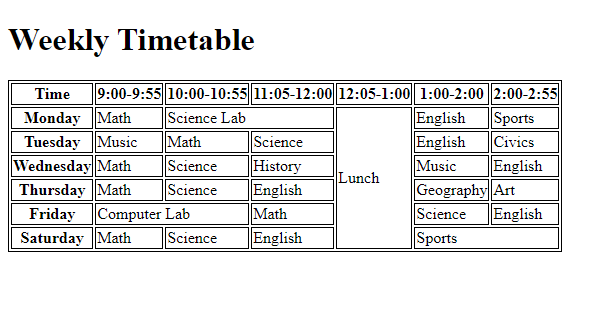

# Weekly Timetable

This project demonstrates a simple weekly timetable (schedule) using HTML and CSS. The timetable displays class schedules for each day of the week, including time slots and subjects.

## Table of Contents
- Overview
- Usage
- Structure
- Styling
- Output

## Overview
The weekly timetable provides a visual representation of class schedules. It includes the following features:
- Time slots (e.g., 9:00 AM - 9:55 AM, 10:00 AM - 10:55 AM, etc.)
- Subjects for each day (Math, Science, English, etc.)
- Special events (Science Lab, Lunch, Computer Lab, etc.)

## Usage
1. Clone this repository to your local machine.
2. Open the `index.html` file in your web browser.
3. View the weekly timetable.

## Structure
The timetable is structured as an HTML table with rows and columns. Each row represents a day of the week, and each column represents a time slot. The subjects are placed within the appropriate cells.

## Styling
The timetable is styled using CSS. The table, header cells (`<th>`), and data cells (`<td>`) have borders to create a grid-like appearance.

## Output

